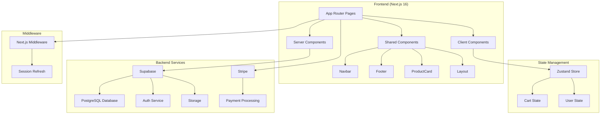
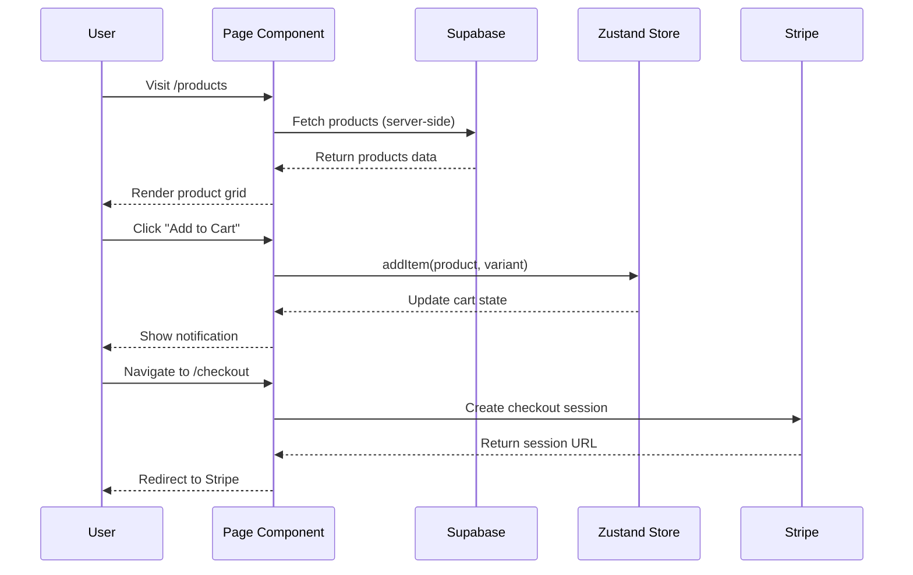
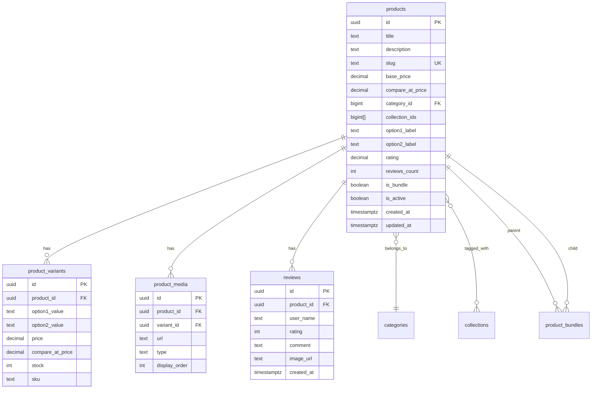

# Design Document

## Overview

This design document outlines the technical architecture and implementation approach for enhancing the Y2KASE e-commerce platform. The enhancements transform the current prototype with mock data into a fully functional e-commerce store with real database integration, authentication, and payment processing.

The design follows Next.js 16 App Router conventions, leverages Supabase for backend services, and maintains the existing Y2K aesthetic theme while improving code organization and user experience.

## Architecture

### High-Level Architecture



### Data Flow



## Components and Interfaces

### Shared Components

#### 1. Navbar Component

```typescript
// src/components/Navbar.tsx
interface NavbarProps {
	transparent?: boolean // For hero sections with gradient backgrounds
}

export function Navbar({ transparent = false }: NavbarProps): JSX.Element
```

Features:

- Responsive design with mobile menu
- Scroll-aware background transition
- Cart icon with item count badge
- Authentication-aware (shows login/account based on auth state)
- Active link highlighting

#### 2. Footer Component

```typescript
// src/components/Footer.tsx
export function Footer(): JSX.Element
```

Features:

- Four-column layout (Brand, Shop, Help, Contact)
- Social media links
- Newsletter signup form
- Copyright and legal links

#### 3. ProductCard Component

```typescript
// src/components/ProductCard.tsx
interface ProductCardProps {
	product: Product
	onAddToCart?: (product: Product) => void
	showQuickActions?: boolean
}

export function ProductCard({ product, onAddToCart, showQuickActions = true }: ProductCardProps): JSX.Element
```

Features:

- Product image with hover zoom effect
- Badge display (New, Sale, Bestseller)
- Star rating display
- Price with optional compare-at price
- Quick action buttons (wishlist, add to cart)

#### 4. Layout Component

```typescript
// src/components/Layout.tsx
interface LayoutProps {
	children: React.ReactNode
	transparentNav?: boolean
	hideFooter?: boolean
}

export function Layout({ children, transparentNav = false, hideFooter = false }: LayoutProps): JSX.Element
```

### Page Components

#### Product Detail Page

```typescript
// src/app/products/[slug]/page.tsx
interface ProductPageProps {
	params: { slug: string }
}

// Server Component for data fetching
export default async function ProductPage({ params }: ProductPageProps)
```

Sub-components:

- `ProductGallery` - Image carousel with thumbnails
- `VariantSelector` - Device/style selection
- `AddToCartButton` - Quantity selector + add button
- `ProductReviews` - Reviews list with rating summary

#### Authentication Pages

```typescript
// src/app/login/page.tsx
export default function LoginPage()

// src/app/signup/page.tsx
export default function SignupPage()
```

Features:

- Form validation with error messages
- Social login options (optional)
- Password visibility toggle
- Remember me checkbox
- Redirect handling

#### Checkout Page

```typescript
// src/app/checkout/page.tsx
export default function CheckoutPage()
```

Sub-components:

- `ShippingForm` - Address collection
- `OrderSummary` - Cart items and totals
- `PaymentSection` - Stripe integration

### Data Fetching Functions

```typescript
// src/lib/supabase/queries.ts

// Fetch all active products with related data
export async function getProducts(options?: { category?: string; collection?: string; limit?: number; offset?: number }): Promise<Product[]>

// Fetch single product by slug
export async function getProductBySlug(slug: string): Promise<Product | null>

// Fetch product reviews
export async function getProductReviews(productId: string): Promise<Review[]>

// Fetch categories
export async function getCategories(): Promise<Category[]>

// Fetch collections
export async function getCollections(): Promise<Collection[]>
```

### API Routes

```typescript
// src/app/api/checkout/route.ts
export async function POST(request: Request): Promise<Response>
// Creates Stripe checkout session

// src/app/api/webhook/stripe/route.ts
export async function POST(request: Request): Promise<Response>
// Handles Stripe webhook events
```

## Data Models

### Database Schema (Already Defined in tables.sql)

The existing schema is well-designed. Key tables:



### TypeScript Types (Enhanced)

```typescript
// src/types/index.ts

export interface Product {
	id: string
	title: string
	description: string
	slug: string
	base_price: number
	compare_at_price?: number
	category_id?: number
	collection_ids: number[]
	category?: Category
	variants?: Variant[]
	media?: ProductMedia[]
	option1_label: string
	option2_label?: string
	rating: number
	reviews_count: number
	is_active: boolean
	is_bundle: boolean
	created_at: string
	updated_at: string
}

export interface Variant {
	id: string
	product_id: string
	option1_value: string
	option2_value?: string
	price?: number
	compare_at_price?: number
	stock: number
	sku: string
}

export interface ProductMedia {
	id: string
	product_id?: string
	variant_id?: string
	url: string
	type: 'image' | 'video'
	display_order: number
}

export interface Review {
	id: string
	product_id: string
	user_name: string
	rating: number
	comment: string
	image_url?: string
	created_at: string
}

export interface Category {
	id: number
	name: string
	slug: string
	created_at?: string
}

export interface Collection {
	id: number
	name: string
	slug: string
	image_url?: string
	created_at?: string
}

export interface CartItem {
	product: Product
	variant: Variant
	quantity: number
}

export interface User {
	id: string
	email: string
	created_at: string
	user_metadata?: {
		full_name?: string
		avatar_url?: string
	}
}

export interface ShippingAddress {
	full_name: string
	email: string
	phone: string
	address_line1: string
	address_line2?: string
	city: string
	state: string
	postal_code: string
	country: string
}

export interface Order {
	id: string
	user_id?: string
	stripe_session_id: string
	status: 'pending' | 'paid' | 'shipped' | 'delivered' | 'cancelled'
	total: number
	shipping_address: ShippingAddress
	items: CartItem[]
	created_at: string
}
```

## Correctness Properties

_A property is a characteristic or behavior that should hold true across all valid executions of a system—essentially, a formal statement about what the system should do. Properties serve as the bridge between human-readable specifications and machine-verifiable correctness guarantees._

Based on the acceptance criteria analysis, the following correctness properties must be validated:

### Property 1: Product Fetching Returns Correct Data

_For any_ query to fetch products, the returned data SHALL include only products where `is_active` is true, and each product SHALL contain its related variants, media, and category data when those relationships exist.

**Validates: Requirements 1.1, 1.2, 1.4**

### Property 2: ProductCard Renders All Required Information

_For any_ valid Product object passed to ProductCard, the rendered output SHALL contain the product's image, name, price, and when applicable, badges (new/sale) and rating stars.

**Validates: Requirements 2.3, 2.5**

### Property 3: Product Detail Page Displays Complete Information

_For any_ product with a valid slug, the detail page SHALL display the title, description, price, all associated images in a gallery (when multiple exist), variant selectors (when variants exist), and reviews with average rating.

**Validates: Requirements 3.1, 3.2, 3.3, 3.4, 3.7**

### Property 4: Variant Selection Updates State Correctly

_For any_ variant selection on a product detail page, the displayed price SHALL match the selected variant's price (or base_price if variant has no override), and clicking "Add to Cart" SHALL add exactly one item with the selected variant to the cart.

**Validates: Requirements 3.5, 3.6**

### Property 5: Authentication Handles Credentials Correctly

_For any_ valid email/password combination, login SHALL succeed and return a user session. _For any_ invalid credentials, login SHALL fail and return a descriptive error message without exposing sensitive information.

**Validates: Requirements 4.3, 4.4, 4.6**

### Property 6: Authentication State Reflects in UI

_For any_ authenticated user, the Navbar SHALL display an account menu. _For any_ unauthenticated user, the Navbar SHALL display a login link. This state SHALL persist across page refreshes.

**Validates: Requirements 4.8, 4.9**

### Property 7: Checkout Validates and Processes Orders

_For any_ checkout submission, all required shipping fields SHALL be validated before creating a Stripe session. _For any_ valid cart with valid shipping information, a Stripe checkout session SHALL be created successfully.

**Validates: Requirements 5.5, 5.8**

### Property 8: Middleware Processes Requests Correctly

_For any_ non-static request, the middleware SHALL attempt to refresh the Supabase auth session. _For any_ request matching static file patterns (images, \_next/static), the middleware SHALL pass through without processing.

**Validates: Requirements 6.2, 6.3**

### Property 9: New Arrivals Sorted Correctly

_For any_ set of products displayed on the New Arrivals page, they SHALL be sorted by `created_at` in descending order (newest first).

**Validates: Requirements 7.5**

### Property 10: Error Boundaries Prevent Crashes

_For any_ component that throws an error during rendering, the error boundary SHALL catch the error and display a fallback UI instead of crashing the entire page.

**Validates: Requirements 8.2, 8.3**

## Error Handling

### Client-Side Errors

1. **Form Validation Errors**

   - Display inline error messages below invalid fields
   - Use red border and error icon for visual indication
   - Clear errors when user corrects input

2. **Network Errors**

   - Display toast notification for transient errors
   - Show retry button for failed data fetches
   - Maintain last known good state when possible

3. **Authentication Errors**
   - Display specific messages (invalid email, wrong password, etc.)
   - Never expose whether an email exists in the system
   - Redirect to login on session expiration

### Server-Side Errors

1. **Database Errors**

   - Log full error details server-side
   - Return generic "Something went wrong" to client
   - Implement retry logic for transient failures

2. **Stripe Errors**

   - Handle card declined, insufficient funds, etc.
   - Display user-friendly payment error messages
   - Log detailed error for debugging

3. **404 Errors**
   - Custom 404 page with Y2K aesthetic
   - Suggest similar products or categories
   - Provide navigation back to home/products

### Error Boundary Implementation

```typescript
// src/components/ErrorBoundary.tsx
'use client'

import { Component, ReactNode } from 'react'

interface Props {
	children: ReactNode
	fallback?: ReactNode
}

interface State {
	hasError: boolean
	error?: Error
}

export class ErrorBoundary extends Component<Props, State> {
	constructor(props: Props) {
		super(props)
		this.state = { hasError: false }
	}

	static getDerivedStateFromError(error: Error): State {
		return { hasError: true, error }
	}

	componentDidCatch(error: Error, errorInfo: React.ErrorInfo) {
		console.error('Error caught by boundary:', error, errorInfo)
		// Log to error tracking service
	}

	render() {
		if (this.state.hasError) {
			return (
				this.props.fallback || (
					<div className='flex flex-col items-center justify-center p-8 text-center'>
						<span className='text-5xl mb-4'>😢</span>
						<h2 className='font-display text-y2k-800 text-xl font-bold mb-2'>Oops! Something went wrong</h2>
						<p className='text-chrome-600 mb-4'>We're sorry, but something unexpected happened.</p>
						<button onClick={() => this.setState({ hasError: false })} className='btn btn-primary'>
							Try Again ✨
						</button>
					</div>
				)
			)
		}

		return this.props.children
	}
}
```

## Testing Strategy

### Dual Testing Approach

This project will use both unit tests and property-based tests for comprehensive coverage:

- **Unit Tests**: Verify specific examples, edge cases, and error conditions
- **Property Tests**: Verify universal properties across all valid inputs

### Testing Framework

- **Test Runner**: Vitest (fast, ESM-native, compatible with Next.js)
- **Property-Based Testing**: fast-check
- **Component Testing**: React Testing Library
- **E2E Testing**: Playwright (optional, for critical flows)

### Test Configuration

```typescript
// vitest.config.ts
import { defineConfig } from 'vitest/config'
import react from '@vitejs/plugin-react'
import path from 'path'

export default defineConfig({
	plugins: [react()],
	test: {
		environment: 'jsdom',
		globals: true,
		setupFiles: ['./src/test/setup.ts'],
		include: ['**/*.test.{ts,tsx}'],
	},
	resolve: {
		alias: {
			'@': path.resolve(__dirname, './src'),
		},
	},
})
```

### Property Test Configuration

Each property test will:

- Run minimum 100 iterations
- Be tagged with the design property it validates
- Use fast-check for input generation

Example property test structure:

```typescript
// src/lib/supabase/__tests__/queries.property.test.ts
import { describe, it, expect } from 'vitest'
import * as fc from 'fast-check'

describe('Product Fetching', () => {
	// Feature: y2kase-enhancements, Property 1: Product Fetching Returns Correct Data
	// Validates: Requirements 1.1, 1.2, 1.4
	it('should only return active products with related data', async () => {
		await fc.assert(
			fc.asyncProperty(fc.array(productArbitrary(), { minLength: 1, maxLength: 20 }), async (products) => {
				// Setup: Insert products into test database
				// Act: Fetch products
				// Assert: All returned products have is_active === true
				// Assert: All returned products have variants, media, category when they exist
			}),
			{ numRuns: 100 }
		)
	})
})
```

### Unit Test Examples

```typescript
// src/components/__tests__/ProductCard.test.tsx
import { render, screen } from '@testing-library/react'
import { ProductCard } from '../ProductCard'
import { mockProduct } from '@/test/mocks'

describe('ProductCard', () => {
	it('renders product name and price', () => {
		render(<ProductCard product={mockProduct} />)
		expect(screen.getByText(mockProduct.title)).toBeInTheDocument()
		expect(screen.getByText(`$${mockProduct.base_price}`)).toBeInTheDocument()
	})

	it('shows sale badge when compare_at_price exists', () => {
		const saleProduct = { ...mockProduct, compare_at_price: 29.99 }
		render(<ProductCard product={saleProduct} />)
		expect(screen.getByText(/off/i)).toBeInTheDocument()
	})
})
```

### Test Coverage Goals

| Area          | Unit Tests                 | Property Tests            |
| ------------- | -------------------------- | ------------------------- |
| Data Fetching | Error handling, edge cases | Filtering, sorting, joins |
| Components    | Rendering, interactions    | Prop variations           |
| Cart Logic    | Add/remove/update          | State consistency         |
| Auth Flow     | Success/failure cases      | Session persistence       |
| Checkout      | Form validation            | Order processing          |
| Middleware    | Route matching             | Session refresh           |

### Continuous Integration

Tests should run on every pull request:

1. Lint check
2. Type check
3. Unit tests
4. Property tests
5. Build verification
